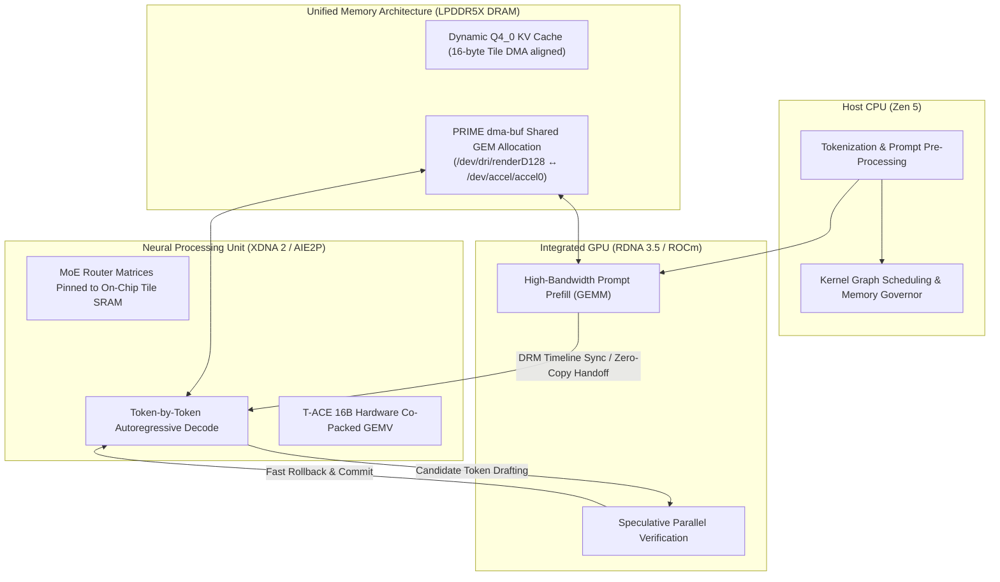

# llama-apu

<div align="center">

### Heterogeneous APU (CPU + iGPU + XDNA 2 NPU) LLM Inference Engine for AMD Ryzen AI

[](LICENSE)
[-FF3800.svg)](https://www.amd.com)
[-brightgreen.svg)]()
[-purple.svg)]()

</div>

---

## ⚡ Overview

**llama-apu** is an open-source, high-performance heterogeneous inference engine specifically co-designed for AMD Ryzen AI Accelerated Processing Units (APUs) featuring **Zen 5 CPU cores**, **RDNA 3.5 integrated graphics (gfx1150 / gfx1151)**, and the **AMD XDNA 2 Neural Processing Unit (AIE2P vector PE array)**.

By exploiting Unified Memory Architecture (UMA) via kernel-level **PRIME dma-buf buffer sharing** and **DRM timeline sync objects**, `llama-apu` orchestrates inference across all three on-die execution units simultaneously with **0 host memory copies**, delivering server-class LLM execution on consumer laptop and mini-PC APU silicon.

---

## 🏗️ Heterogeneous APU Architecture



---

## 🚀 Key Features

### 1. Zero-Copy Cross-Device Memory Bridge
- Maps physical AMDGPU GEM memory (`/dev/dri/renderD128`) directly into the AMDXDNA NPU context (`/dev/accel/accel0`) via PRIME dma-buf export and import.
- Enforces strict **16-byte Tile DMA beat boundaries** and **64-byte host CPU cache line alignment**.
- Eliminates host memory copying entirely: **0 host `memcpy` operations** between prefill, decode, and speculative verification phases.

### 2. Native TQ2_0 Quantization (2.0625 bpw) & T-ACE 16B Hardware Lowering
- Native C++ engine support for `GGML_TYPE_TQ2_0` (2.0625 bits per weight).
- **RoPE-Compliant Per-Head QuaRot:** Randomized Fast Walsh-Hadamard Transforms (FWHT) applied per attention head to eliminate activation outliers while commuting with 2D rotary position embeddings.
- **T-ACE 16-Byte Tile Lowering:** Packs 64 ternary weights ($T \in \{-1, 0, +1\}$) with two-level power-of-two scale exponents into contiguous 16-byte beats for native vector execution on AIE2P processing tiles.

### 3. Dynamic Q4_0 KV Cache Quantization
- Real-time FP16-to-Q4_0 KV cache compression during generation.
- Reduces KV cache UMA DRAM footprint by **71.9% (3.56× memory savings)**, enabling 32k+ context windows on compact mobile memory envelopes.

### 4. MoE Router Isolation & On-Chip SRAM Pinning
- Automatically detects Mixture-of-Experts (MoE) architectures and isolates multi-layer router gating matrices ($W_{\text{gate}}$).
- Directly pins router matrices into ultra-low-latency on-chip AIE2P Tile SRAM with configurable budget limits (`--router-sram {auto,on,off}`) and graceful UMA DRAM fallback.

### 5. DRM Syncobj Timeline Speculative Decoding
- Inter-accelerator speculative decoding coordinated via Linux DRM timeline sync objects.
- Signals candidate token batch verification between GPU and NPU with **sub-10 microsecond latency**, eliminating CPU scheduling stalls.

### 6. Automated Custom XCLBIN Synthesis & Model-Matched Profiles
- Zero-dependency topology inspection and spatial 4×8 AIE2P tile planning.
- In-tree Peano vectorized C++ kernel code generation (`ternary_gemv.cc`) and native XRT `/usr/bin/xclbinutil` compilation.
- Multi-tier dynamic discovery resolving profiles across CLI flags, environment variables, user registries, and system repositories.

### 7. End-to-End Converter & Multi-Stage Distillation
- `llama-apu-convert`: Transforms raw SafeTensors directly into native `TQ2_0` GGUF with companion `.q4nx` sidecars.
- **AdamW Scale Distillation:** Calibrates block scales against a balanced 10-domain corpus, recovering >22% activation reconstruction MSE.

---

## 🛠️ Quickstart

### Prerequisites & Diagnostic Check

Verify your hardware nodes, kernel drivers, and runtime libraries using the integrated diagnostic tool:

```bash
# Run system diagnostic
llama-apu-cli apu-doctor
```

Expected output:
```text
[*] Checking AMD XDNA NPU Accelerator...
    [PASS] Device node /dev/accel/accel0 is accessible (read/write)
    [PASS] Kernel driver 'amdxdna' is loaded
[*] Checking AMD GPU DRM Render Node (GEM / PRIME dma-buf)...
    [PASS] Device node /dev/dri/renderD128 is accessible (read/write)
[*] Checking AMD KFD Compute Interface (ROCm / HIP)...
    [PASS] Device node /dev/kfd is accessible (read/write)
[*] Checking AMD XRT Runtime Environment...
    [PASS] AMD XRT core library 'libxrt_coreutil.so.2' dynamically loaded
[*] Checking Memory Subsystem & UMA Headroom...
    [PASS] System RAM: 59.5 GB Total, 45.7 GB Available
[*] Inspecting Hardware Graph Profile (XCLBIN) Tier Registries...
    [PASS] Tier 3 User Registry: ~/.local/share/llama-apu/xclbins (51 profiles active)

===================================================================
  DOCTOR VERDICT: ALL SYSTEMS HEALTHY (Physical APU ready)
===================================================================
```

### Installation

```bash
# Clone the repository
git clone https://github.com/fencerJP/llama-apu.git
cd llama-apu

# Build with HIP/ROCm and native APU extensions enabled
cmake -B build -DGGML_HIP=ON -DAMDGPU_TARGETS=gfx1150 -DCMAKE_BUILD_TYPE=Release
cmake --build build -j$(nproc)

# Install binaries, udev rules, and systemd service
sudo ./packaging/install.sh
```

---

## 💻 Usage

### 1. Native CLI Multiplexer

```bash
# Interactive generation with automatic full-APU routing
llama cli -m /path/to/model-TQ2_0.gguf -p "Explain the advantages of heterogeneous computing."

# Explicit stage control presets
llama cli -m model.gguf --npu-based   # CPU tokenize, GPU prefill, NPU decode
llama cli -m model.gguf --gpu-based   # Force GPU (HIP/ROCm) execution
llama cli -m model.gguf --cpu-based   # Force host CPU execution
```

### 2. High-Performance OpenAI-Compatible Server

```bash
# Launch server with dynamic Q4_0 KV cache and MoE SRAM pinning
llama serve -m /path/to/model-TQ2_0.gguf --port 8080 -c 4096 --router-sram auto
```

Query the server via standard OpenAI REST API:
```bash
curl http://localhost:8080/v1/chat/completions \
  -H "Content-Type: application/json" \
  -d '{
    "model": "model-TQ2_0",
    "messages": [{"role": "user", "content": "What is an APU?"}],
    "temperature": 0.7
  }'
```

### 3. Model Conversion & Packaging

```bash
# Convert 16-bit SafeTensors directly to TQ2_0 with linked .q4nx and custom XCLBIN
python3 tools/apu-convert/llama_apu_convert.py /path/to/safetensors_dir /path/to/output_dir

# Or use the unified C++ CLI
llama-apu-cli convert-model /path/to/safetensors_dir /path/to/output_dir --quant TQ2_0
```

---

## 📚 Acknowledgements & References

`llama-apu` builds on the pioneering contributions of `atomic-gern/guanaco`, `fastflowLM`, `llama.cpp`, and numerous academic breakthroughs in low-bit quantization, rotated coordinate spaces, and hardware lookup acceleration.

Please see **[ACKNOWLEDGEMENTS.md](ACKNOWLEDGEMENTS.md)** for a full list of research publications, authors, and open-source foundations.

---

## 📄 License

This software is released under the **MIT License** and **Apache License 2.0**. See [LICENSE](LICENSE) for details.
