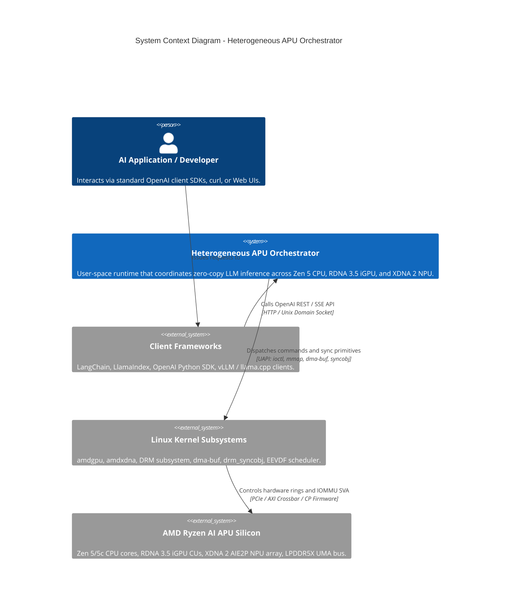

<!--
  SPDX-License-Identifier: Apache-2.0
  Copyright (c) 2026 Heterogeneous APU Orchestrator Contributors
-->

# C4 Architecture Specification: Heterogeneous APU Orchestrator

This document provides the complete C4 Architectural Model (System Context, Container, and Component levels) and the Hexagonal Architecture decomposition for the Heterogeneous APU Orchestrator runtime.

---

## 1. Level 1: System Context Diagram

The System Context diagram establishes how external consumers, client libraries, the Linux kernel, and the underlying APU silicon interface with the Orchestrator runtime.



### Context Boundary Descriptions
- **Client Frameworks:** Interface with the runtime daemon via standard OpenAI JSON payloads over HTTP/1.1, HTTP/2, or local Unix Domain Sockets (`/run/zero-copy-runner/runner.sock`).
- **Heterogeneous APU Orchestrator:** The single authority for model residency, memory topology, phase disaggregation (iGPU prefill vs. NPU decode), and hardware fence chaining.
- **Linux Kernel:** Mediates physical hardware access without intervention in the inner token generation loop.
- **APU Silicon:** Executes compute kernels and streams memory directly across unified LPDDR5X DRAM without host-mediated copy passes.

---

## 2. Level 2: Container Diagram

The Container diagram illustrates the runtime boundaries, IPC channels, kernel interfaces, and firmware layers executing within the host environment.

```mermaid
C4Container
    title Container Diagram - Runtime Boundaries & Subsystems

    Container_Boundary(user_space, "User-Space Execution Environment")
        Container(cli_runner, "Drop-In CLI (`llama-cli` / `llama`)", "Rust / C++", "Drop-in CLI binary accepting standard flags, handling interactive chat, hardware routing, and tool calling.")
        Container(api_server, "Drop-In Server (`llama-server`)", "Rust / Tokio / Axum", "Drop-in server daemon terminating OpenAI REST/SSE API, managing slots and streaming.")
        Container(orchestrator_core, "Zero-Copy Heterogeneous Orchestration Engine", "Rust / Core Domain", "Maintains execution state machine, buffer ownership, and cross-device handoffs.")
        Container(cpu_worker, "CPU AVX-512 Worker", "Rust / C++ Intrinsic", "Runs fast BPE tokenization, embedding lookup, and logit probability sampling on Zen 5 Classic cores.")
        Container(rocm_shim, "ROCm / HIP Prefill Driver SHIM", "C++20 / HIP Runtime", "Executes real batched GEMM prefill kernels on RDNA 3.5 iGPU via libdrm_amdgpu.")
        Container(xrt_shim, "XDNA XRT User-Mode SHIM", "C++20 / XRT API", "Loads xclbin and executes real autoregressive GEMV decode steps on XDNA 2 AIE2P tiles.")
    Container_Boundary_End()

    Container_Boundary(kernel_space, "Linux Kernel Space (UAPI Boundary)")
        Container(amdgpu_kmod, "amdgpu Kernel Driver", "DRM Subsystem", "Manages iGPU rings, GEM allocation, and GPU timeline fences.")
        Container(amdxdna_kmod, "amdxdna Kernel Driver", "DRM Accel Subsystem", "Manages NPU hardware mailboxes, IOMMU SVA, and ERT firmware lifecycle.")
        Container(dmabuf_syncobj, "dma-buf & drm_syncobj", "Linux Core Drivers", "Provides cross-device buffer handles (Prime FDs) and hardware dma_fences.")
    Container_Boundary_End()

    Container_Boundary(firmware_silicon, "Silicon & Embedded Coprocessor Firmware")
        Container(gpu_cp, "iGPU Command Processor (CP)", "Firmware", "Processes prefill command streams and signals completion fences.")
        Container(npu_ert, "NPU Embedded Runtime (ERT)", "Firmware Microcontroller", "Schedules spatial tile DMAs and synchronizes tile compute without CPU interrupts.")
        ContainerDb(uma_ram, "Unified System RAM (LPDDR5X)", "Hardware", "128-bit or 256-bit bus hosting weights and zero-copy shared KV cache.")
    Container_Boundary_End()

    Rel(cli_runner, orchestrator_core, "Dispatches interactive / batch prompt", "Direct In-Process API")
    Rel(api_server, orchestrator_core, "Dispatches validated OpenAI HTTP requests", "Rust Channel (mpsc)")
    Rel(orchestrator_core, cpu_worker, "Invokes tokenization & logit sampling", "In-Process Function")
    Rel(orchestrator_core, rocm_shim, "Invokes real prefill GEMM", "Direct C FFI")
    Rel(orchestrator_core, xrt_shim, "Invokes real decode token step", "Direct C FFI")
    
    Rel(rocm_shim, amdgpu_kmod, "Submits commands & exports dma-buf", "/dev/dri/renderD128 ioctl")
    Rel(xrt_shim, amdxdna_kmod, "Submits NPU job & imports dma-buf", "/dev/accel/accel0 ioctl")
    Rel(amdgpu_kmod, dmabuf_syncobj, "Exports/Imports GEM Prime FDs", "Kernel DMA-BUF API")
    Rel(amdxdna_kmod, dmabuf_syncobj, "Attaches shared dma-buf", "Kernel DMA-BUF API")

    Rel(amdgpu_kmod, gpu_cp, "Writes doorbells & ring packets", "MMIO / Ring Buffer")
    Rel(amdxdna_kmod, npu_ert, "Dispatches mailbox command packets", "Shared SRAM Mailbox")
    Rel(gpu_cp, uma_ram, "Prefill reads weights / writes KV cache", "LPDDR5X Memory Bus")
    Rel(npu_ert, uma_ram, "Decode reads weights & KV cache", "LPDDR5X Memory Bus")
```

---

## 3. Level 3: Component Diagram (Hexagonal Architecture Decomposition)

The Component diagram decomposes the Orchestration Engine following strict Hexagonal Architecture (Ports and Adapters) principles. The Core Domain is decoupled from driver APIs, hardware topologies, and network protocols.

```mermaid
C4Component
    title Component Diagram - Hexagonal Core Domain & Adapters

    Container_Boundary(hex_core, "Hexagonal Core Domain (Pure Logic)")
        Component(state_machine, "Graph Execution State Machine", "Rust Struct", "Tracks request states: Pending -> Ingest -> Prefill -> Decode -> Complete.")
        Component(hardware_router, "Hardware Router & APU Policy Selector", "Rust Struct", "Selects per-APU optimal profiles or applies user CLI routing flags (--gpu-based, --cpu-based, --npu-based, --tokenize, --prefill, --decode, --sample).")
        Component(cost_engine, "Dynamic Cost Engine", "Rust Struct", "Evaluates queue depths, memory bandwidth headroom, and silicon thermal limits.")
        Component(kv_manager, "Virtual KV Cache Manager", "Rust Struct", "Maintains logical block tables, sequence mapping, and zero-copy allocations.")
    Container_Boundary_End()

    Container_Boundary(inbound_adapters, "Inbound Ports & Adapters (Drivers)")
        Component(http_adapter, "OpenAI API Adapter", "Axum / SSE", "Translates HTTP JSON requests to domain commands; streams SSE token events.")
        Component(cli_adapter, "Unix CLI / Admin Adapter", "Clap / IPC", "Exposes management, telemetry, and debugging interface.")
    Container_Boundary_End()

    Container_Boundary(outbound_adapters, "Outbound Ports & Adapters (Driven)")
        Component(mem_adapter, "GEM / dma-buf Memory Adapter", "Linux UAPI", "Allocates DRM GEM buffers, exports Prime FDs, and attaches them to XRT.")
        Component(prefill_adapter, "ROCm / HIP Prefill Adapter", "libamdhip64", "Dispatches batched GEMM prefill kernels to RDNA 3.5 iGPU.")
        Component(decode_adapter, "XRT / XDNA Decode Adapter", "libxrt_core", "Configures AIE2P tile dataflows and fires single-token decode dispatches.")
        Component(affinity_adapter, "POSIX / hwloc Topology Adapter", "libc / hwloc", "Discovers Zen 5 / Zen 5c NUMA clusters and locks threads via pthread_setaffinity_np.")
        Component(sync_adapter, "DRM Syncobj Timeline Adapter", "libdrm", "Manages timeline fence wait/signal operations across GPU and NPU.")
    Container_Boundary_End()

    Rel(http_adapter, state_machine, "Submits NewInferenceSession", "Inbound Port")
    Rel(cli_adapter, cost_engine, "Queries HardwareTelemetry", "Inbound Port")

    Rel(state_machine, cost_engine, "Queries optimal partition plan", "Internal Domain")
    Rel(state_machine, kv_manager, "Requests KV block allocation", "Internal Domain")

    Rel(state_machine, mem_adapter, "Calls MemoryPort::allocate_shared()", "Outbound Port")
    Rel(state_machine, prefill_adapter, "Calls PrefillPort::dispatch_prefill()", "Outbound Port")
    Rel(state_machine, decode_adapter, "Calls DecodePort::dispatch_decode_step()", "Outbound Port")
    Rel(state_machine, affinity_adapter, "Calls TopologyPort::bind_worker()", "Outbound Port")
    Rel(state_machine, sync_adapter, "Calls SyncPort::await_timeline_fence()", "Outbound Port")
```

---

## 4. Port & Adapter Interface Definitions

### 4.1 Inbound Ports
- **`InferenceServicePort`**:
  ```rust
  pub trait InferenceServicePort: Send + Sync {
      fn submit_chat_completion(
          &self,
          req: ChatCompletionRequest,
      ) -> BoxStream<'static, Result<ChatCompletionChunk, InferenceError>>;
  }
  ```

### 4.2 Outbound Ports
- **`MemoryPort` (Zero-Copy Buffer Management):**
  ```rust
  pub trait MemoryPort: Send + Sync {
      fn allocate_shared_gem(&self, size_bytes: usize) -> Result<DmaBufHandle, MemoryError>;
      fn export_prime_fd(&self, handle: &DmaBufHandle) -> Result<RawFd, MemoryError>;
      fn import_xrt_bo(&self, fd: RawFd, size_bytes: usize) -> Result<XrtBoHandle, MemoryError>;
  }
  ```
- **`PrefillPort` (Compute-Bound Execution):**
  ```rust
  pub trait PrefillPort: Send + Sync {
      fn dispatch_prefill(
          &self,
          prompt_token_ids: &[u32],
          kv_cache: &DmaBufHandle,
          signal_syncobj: &SyncobjHandle,
          timeline_point: u64,
      ) -> Result<(), PrefillError>;
  }
  ```
- **`DecodePort` (Memory-Bound Token Generation):**
  ```rust
  pub trait DecodePort: Send + Sync {
      fn dispatch_decode_step(
          &self,
          current_token_id: u32,
          step_index: u32,
          kv_cache: &XrtBoHandle,
          wait_syncobj: &SyncobjHandle,
          timeline_point: u64,
      ) -> Result<u32, DecodeError>;
  }
  ```
- **`TopologyPort` (Core Pinning & Microarchitectural Affinity):**
  ```rust
  pub trait TopologyPort: Send + Sync {
      fn discover_topology(&self) -> ApuTopology;
      fn pin_current_thread(&self, role: WorkerRole) -> Result<(), TopologyError>;
  }
  ```
- **`SyncPort` (Hardware Fence Chaining):**
  ```rust
  pub trait SyncPort: Send + Sync {
      fn create_timeline_syncobj(&self) -> Result<SyncobjHandle, SyncError>;
      fn wait_timeline(&self, handle: &SyncobjHandle, point: u64, timeout_ns: i64) -> Result<bool, SyncError>;
  }
  ```

---

## 5. Architectural Quality Attributes & Trade-Offs

1. **Zero-Copy Integrity:** The `MemoryPort` guarantees that `DmaBufHandle` and `XrtBoHandle` point to identical physical DRAM pages. The host kernel page tables are mapped once; subsequent tensor writes by the GPU are immediately visible to the NPU IOMMU.
2. **Deterministic Latency:** The `TopologyPort` eliminates cache-invalidation penalties by isolating thread domains. Zen 5 Classic cores retain hot AVX-512 SIMD state without eviction from context switches.
3. **Hardware Agnosticism at Core:** The Core Domain contains zero device-driver includes (`hip_runtime.h`, `xrt.h`). All driver specifics reside strictly in their respective adapter crates.
