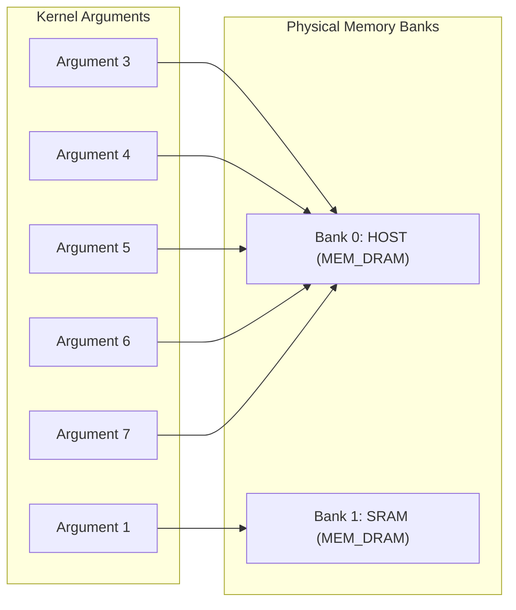

# Reverse-Engineering Dossier: `attn.xclbin`

**Analyzed on**: 2026-09-14 05:13:07  
**Binary Source**: `/home/fencer/.openclaw/workspace/projects/fastflowlm/src/xclbins/Qwen3.6-35B-A3B-NPU2/attn.xclbin`  
**SHA-256 Digest**: `688722319e74310dde4034e4e4c3bd6ad9b197a9cbdfbfb161b18c88eed52fed`  
**Container Size**: 315,900 bytes (308.50 KB)  

---

## 1. Executive Hardware Architecture Summary

- **Target Generation**: **NPU2** (`AMD XDNA 2 / AIE2P (32-tile spatial array)`)
- **Supported Silicon Processors**: Strix Point (Ryzen AI 300 / HX 370), Krackan Point, Gorgon Point, & Strix Halo
- **XRT Container UUID**: `21d08ab5-c110-febe-36b1-60e95ebc120a`
- **Container Version**: `2.25.00`
- **Spatial Column Width**: **8 columns** (32 active spatial compute tiles)
- **Operations per Cycle**: `2048`

---

## 2. Container Sections Inventory

| Section Name | Format / Type | Extracted Artifact Path |
| :--- | :--- | :--- |
| **`MEM_TOPOLOGY`** | Binary / XRT Header | `mem_topology.json` |
| **`AIE_PARTITION`** | Binary / XRT Header | `aie_partition.json` |
| **`EMBEDDED_METADATA`** | Binary / XRT Header | `embedded_metadata.xml` |
| **``** | Binary / XRT Header | *Embedded in PDI / In-Memory* |

---

## 3. Physical Memory Configuration (`MEM_TOPOLOGY`)

| Bank Index | Memory Tag | Type | Base Address | Size (KB) | Size (MB) | Bank Used |
| :--- | :--- | :--- | :--- | :--- | :--- | :--- |
| **0** | `HOST` | `MEM_DRAM` | `0x4000000` | `0x10000` (65536 KB) | 64.0 MB | YES |
| **1** | `SRAM` | `MEM_DRAM` | `0x4000000` | `0xc000` (49152 KB) | 48.0 MB | YES |

---

## 4. DPU Kernel Layout & Execution Interface (`IP_LAYOUT` & `EMBEDDED_METADATA`)

### IP Layout Instances

| Instance Name | Kernel ID | Subtype | Base Address |
| :--- | :--- | :--- | :--- |
| `MLIR_AIE:MLIRAIE` | `0x901` | `DPU` | `not_used` |

### Kernel Function Signature & Arguments

- **Kernel Name**: `MLIR_AIE`
- **Type**: `dpu`
- **Architecture Tag**: `N/A`
- **Model Dimensions**: Hidden Dim=`N/A`, Heads=`N/A`, KV Heads=`N/A`, Layers=`N/A`

| Argument ID | Name | Type | Qualifier | Size | Host Offset |
| :--- | :--- | :--- | :--- | :--- | :--- |
| `0` | `opcode` | `uint64_t` | Value (Scalar) | `0x8` | `0x0` |
| `1` | `instr` | `char *` | Pointer (Buffer Object) | `0x8` | `0x0` |
| `2` | `ninstr` | `uint32_t` | Value (Scalar) | `0x4` | `0x0` |
| `3` | `bo0` | `void*` | Pointer (Buffer Object) | `0x8` | `0x0` |
| `4` | `bo1` | `void*` | Pointer (Buffer Object) | `0x8` | `0x0` |
| `5` | `bo2` | `void*` | Pointer (Buffer Object) | `0x8` | `0x0` |
| `6` | `bo3` | `void*` | Pointer (Buffer Object) | `0x8` | `0x0` |
| `7` | `bo4` | `void*` | Pointer (Buffer Object) | `0x8` | `0x0` |

---

## 5. Crossbar Memory Connectivity (`CONNECTIVITY`)

Routes kernel buffer arguments directly to specific physical memory banks:

| Kernel Argument Index | IP Layout Index | Target Memory Bank Index | Memory Bank Tag |
| :--- | :--- | :--- | :--- |
| Argument `bo-2` (arg `1`) | `0` | Bank `1` | **`SRAM`** |
| Argument `bo0` (arg `3`) | `0` | Bank `0` | **`HOST`** |
| Argument `bo1` (arg `4`) | `0` | Bank `0` | **`HOST`** |
| Argument `bo2` (arg `5`) | `0` | Bank `0` | **`HOST`** |
| Argument `bo3` (arg `6`) | `0` | Bank `0` | **`HOST`** |
| Argument `bo4` (arg `7`) | `0` | Bank `0` | **`HOST`** |



---

## 6. Spatial AIE Partition Geometry (`AIE_PARTITION`)

- **Partition Name**: ``
- **Active Column Width**: **8**
- **Start Columns**: `['0']`
- **Inference Fingerprint**: `23423`
- **Pre/Post Fingerprint**: `12345`

### Embedded Hardware PDI Reference

- **PDI UUID**: `e0925e41-75ef-49e5-b3bd-ec3822782f66`
- **Target PDI File**: `e0925e41-75ef-49e5-b3bd-ec3822782f66.pdi`
  - **CDO Group**: `DPU` (Type: `PRIMARY`, PDI ID: `0x1`, Kernel IDs: `['0x901']`)

---

## 7. Deep PDI & CDO Microcode Disassembly

- **PDI Binary Size**: 309,440 bytes
- **BootROM Sync Header**: VALID (0x11223344 ...)
- **PDI Identification**: `AMD AIE Spatial Partition Image (aie_image)`
- **CDO Stream Offset**: `0x154`
- **CDO Header Version**: `0x0200`
- **CDO Command Words**: `77,270 words` (309,080 bytes)

### CDO Hardware Instruction Breakdown

| Command Opcode / ID | Count | Purpose in Spatial Interconnect |
| :--- | :--- | :--- |
| **`AIE_STREAM_CONFIG`** | 16 | Inter-tile stream switch crossbar circuit configuration |
| **`DMA_XFER`** | 14 | Tile DMA channel transfer descriptor initialization |
| **`MASK_WRITE`** | 6 | Atomic bitmasked register configuration (locks, stream switches) |
| **`MASK_POLL`** | 2 | Hardware synchronization polling (barrier wait) |
| **`CMD_0x72_ba`** | 1 | Custom / Proprietary AIE microcode command |
| **`NOP`** | 1 | Instruction alignment padding |

### AI Engine Tile Registers Configured (Sample)

| Target Address | Tile Column | Register Offset | Operation |
| :--- | :--- | :--- | :--- |
| `0x00232000` | Col 8 | `0x32000` | `MASK_WRITE` |
| `0x0021de10` | Col 8 | `0x1de10` | `MASK_WRITE` |
| `0x0021de18` | Col 8 | `0x1de18` | `MASK_WRITE` |
| `0x0021de00` | Col 8 | `0x1de00` | `MASK_WRITE` |
| `0x0021de08` | Col 8 | `0x1de08` | `MASK_WRITE` |
| `0x00202ea4` | Col 8 | `0x02ea4` | `MASK_WRITE` |

### Recovered Symbol & Internal Strings

- `aie_image`

---

## 8. Cross-APU Binary Portability Assessment

### Compatibility Status: **AMD XDNA 2 (AIE2P)**
- [x] **Strix Point (Ryzen AI 9 HX 370 / 365)**: Native execution (32 spatial tiles active).
- [x] **Krackan Point / Gorgon Point**: Native execution (identical tile architecture).
- [x] **Strix Halo (Ryzen AI Max+ 395)**: Compatible in 32-tile spatial compatibility mode.
- [ ] **Phoenix / Hawk Point (Ryzen 7040 / 8040)**: **INCOMPATIBLE** (Hardware mismatch: NPU1 uses 20 tiles / 5 columns and AIE2 VLIW ISA).

---

## 9. Zero-Copy Model Runner Deployment Checklist

1. **Embedding into `.q4nx` Header**:
   ```bash
   ./build/bin/apu-run -m <model>.gguf -x /home/fencer/.openclaw/workspace/projects/fastflowlm/src/xclbins/Qwen3.6-35B-A3B-NPU2/attn.xclbin --embed-xclbin
   ```
2. **Shared KV-Cache DMA-BUF Sizing**:
   - Minimum recommended DMA-BUF allocation: **64 MB** (64-byte aligned).
3. **Direct PDI Microcode Extraction**:
   - PDI extracted to: `/home/fencer/.openclaw/workspace/projects/zero-copy_model_runner/tools/reverse_engineering/qwen35_analysis/Qwen3.6-35B-A3B-NPU2/attn_extracted/e0925e41-75ef-49e5-b3bd-ec3822782f66.pdi` (309,440 bytes).
   - Can be used directly as a hardware template in `XclbinBuilder::new(TargetHardware::Npu2Aie2p, ...)`.
